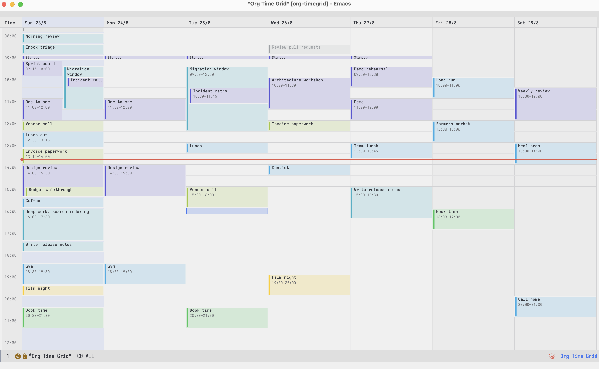
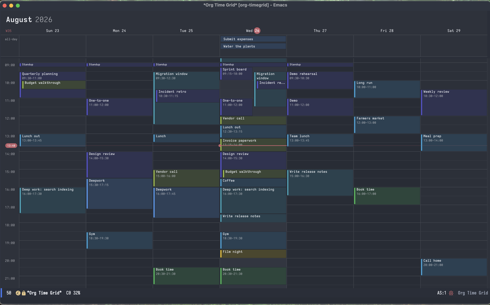
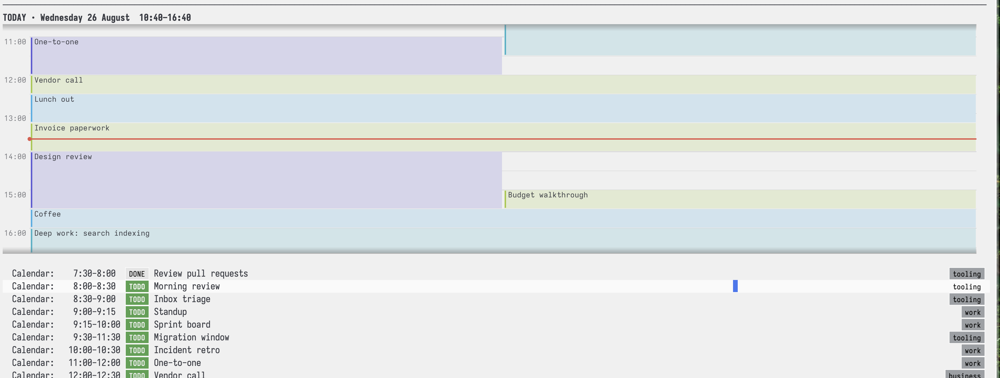
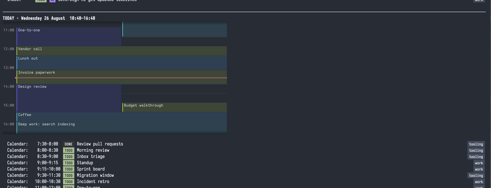

# org-timegrid

`org-timegrid` is an SVG week calendar for Org mode. It reads timed active
timestamps from your Org files and writes edits back to their source headings.

Create, move, resize, copy, rename, and remove calendar blocks with the mouse
or keyboard. The same renderer can add a compact, read-only day view to an
existing Org Agenda.


https://github.com/user-attachments/assets/fa93bdc9-91cb-4582-8d44-47a8461c2007


## Screenshots

The palette comes from the theme, and is redrawn when the theme changes.

| | |
|---|---|
|  |  |

Agenda view:

| | |
|---|---|
|  |  |


## Requirements and installation

You need Emacs 29.1 or later with SVG support and Org 9.6 or later. Check SVG
support with `(image-type-available-p 'svg)`. There are no other dependencies.

With [Elpaca](https://github.com/progfolio/elpaca):

```elisp
(use-package org-timegrid-org
  :ensure (org-timegrid :host github :repo "Gleek/org-timegrid")
  :commands (org-timegrid-week)
  :bind ("C-c c" . org-timegrid-week)
  :config
  (setq org-timegrid-org-capture-file "~/org/inbox.org"))
```

The two names have different jobs. `org-timegrid` is the package and repository
name. `org-timegrid-org` is the feature that connects the renderer to Org, so
it is the feature that `use-package` configures.

For a manual install, put the `.el` files on `load-path`, evaluate `(require
'org-timegrid-org)`, then run `M-x org-timegrid-week`.

## What appears on the calendar

The Org backend reads active timestamps with a start time. They may be plain
timestamps or values attached to `SCHEDULED` and `DEADLINE`.

```org
* TODO Design review :work:
<2026-08-24 Mon 14:00-15:30>

* TODO Standup
SCHEDULED: <2026-08-24 Mon 09:00-09:15>

* Call the vendor
<2026-08-24 Mon 15:00>
```

The last heading appears even though it has no TODO keyword. A timed active
timestamp is enough to put a heading on the calendar. A timestamp without an
end uses `org-timegrid-default-duration-minutes`, which defaults to 30 minutes.

Date-only and inactive timestamps do not appear on the time grid. A separate
date-only rail is planned.

Repeaters are expanded into dated occurrences for display. Moving or resizing
one occurrence edits the series anchor and preserves its repeater and warning
modifiers. Edits leave source buffers modified but unsaved, like Org Agenda
commands. Press `u` in the calendar to undo the edit in the Org buffer it
changed.

## Week view

Run `M-x org-timegrid-week` to open the week containing today.

### Mouse

| Gesture | Action |
|---|---|
| Drag empty space | Create an entry for that range |
| Drag a block | Move it |
| Drag a block's top or bottom edge | Resize it |
| Option-drag a block | Copy it |
| Click | Put the cursor there |
| Double-click a block | Visit its Org heading |
| Wheel | Scroll the day |

Mouse edits snap to 15 minutes and use a 15-minute minimum. Release commits a
drag. Press `C-g` before releasing to cancel it.

### Keyboard

The calendar has one cursor. A block is selected when the cursor sits on the
slot where that block begins. This keeps keyboard and mouse selection in sync
after redraws.

| Key | Action |
|---|---|
| `C-n` / `C-p`, arrows | Move to the next or previous time stop |
| `C-f` / `C-b`, left/right | Move through overlapping lanes, then days |
| `M-down` / `M-up` | Move the cursor by 15 minutes |
| `C-v` / `M-v`, `SPC` | Move by one screen |
| `C-a` / `C-e` | Go to the first or last slot of the day |
| `C-l` | Center the view on the cursor |
| `n` / `p` | Select the next or previous block |
| `RET` | Visit the selected block, or create one at the cursor |
| `C-g` | Hide the cursor |
| `M-S-down` / `M-S-up` | Move the selected block by 15 minutes |
| `M-S-right` / `M-S-left` | Move the block by one day |
| `M-S-s-right` / `M-S-s-left` | Copy the block by one day |
| `S-down` / `S-up` | Move the end time |
| `C-S-up` / `C-S-down` | Move the start time |
| `t` | Enter a new time or range |
| `e` | Rename the heading |
| `d`, Delete | Remove its time, then optionally delete the heading |
| `M-w` / `C-w` / `C-y` | Copy, cut, or paste a block |
| `u`, `C-/`, `C-x u` | Undo the last calendar edit |
| `b` / `f`, `M-b` / `M-f` | Shift by a day or week |
| `j` / `.` | Jump to a date or today |
| `g` | Reload the week from the backend |
| `q` | Quit |

Horizontal motion, including `n` and `p`, crosses week boundaries. If the next
week has no block to select, the calendar still opens it and leaves the cursor
at the near edge.

Entries do not need to align to the grid. An entry from 13:50 to 14:10 remains
reachable and editable. Snapping applies when you change it.

## Org Agenda strip

Enable the optional integration after loading `org-timegrid-agenda`:

```elisp
(require 'org-timegrid-agenda)
(org-timegrid-agenda-mode 1)
```

Org continues to build the agenda buffer. A finalize hook inserts a read-only
SVG view of the hours around the current time. Press `RET` on the image to open
the editable week view.

```elisp
(setq org-timegrid-agenda-insert-after "To Refile"
      org-timegrid-agenda-separator nil)
```

The first option matches the agenda block above the strip. A nil separator lets
the following block read as the untimed part of the same day section. The strip
shades an edge only when an event continues beyond the visible window.

`org-timegrid-day-blocks` gets and lays out one day's blocks.
`org-timegrid-day-image` draws a chosen minute range as an SVG image. Neither
function needs a calendar buffer.

## Colours

The grid, text, cursor, and backgrounds use the current Emacs theme. Images
redraw after a theme change and respect buffer-local face remapping.

Map Org tags to the built-in macOS-style palette or any colour string Emacs
accepts:

```elisp
(setq org-timegrid-org-tag-color-alist
      '(("work" . indigo)
        ("business" . lime)
        ("reading" . green)
        ("errand" . cyan)
        ("urgent" . "#b4d74a")))
```

The named colours are `blue`, `cyan`, `teal`, `indigo`, `purple`, `pink`,
`red`, `orange`, `yellow`, `lime`, `green`, `brown`, and `graphite`. The first
mapped tag wins. Set `org-timegrid-org-color-function` to colour by TODO state,
priority, property, or file.

## Configuration

| Variable | Default | Meaning |
|---|---:|---|
| `org-timegrid-start-hour` / `org-timegrid-end-hour` | `0` / `24` | Hours drawn |
| `org-timegrid-pixels-per-minute` | `0.9` | Week-view scale |
| `org-timegrid-slot-minutes` | `15` | Cursor and edit granularity |
| `org-timegrid-cursor-step-minutes` | `30` | Normal keyboard step |
| `org-timegrid-default-duration-minutes` | `30` | Length used when no end is present |
| `org-timegrid-block-gap` | `3` | Gap between blocks, in pixels |
| `org-timegrid-corner-radius` | `0` | Block corner radius |
| `org-timegrid-nesting-indent` | `8` | Indent for contained events |
| `org-timegrid-title-clearance` | `18` | Space a parent keeps for its title |
| `org-timegrid-data-refresh-seconds` | `300` | Backend reload interval |

| Agenda variable | Default | Meaning |
|---|---:|---|
| `org-timegrid-agenda-minutes-before` / `-after` | `180` / `180` | Visible window around now |
| `org-timegrid-agenda-insert-after` | `"To Refile"` | Block above the strip |
| `org-timegrid-agenda-separator` | `t` | Separator after the strip |
| `org-timegrid-compact-pixels-per-minute` | `0.95` | Strip scale |
| `org-timegrid-compact-font-size` | `11` | Strip text size |

| Org variable | Default | Meaning |
|---|---:|---|
| `org-timegrid-org-files` | `agenda` | Files to query; a list is literal |
| `org-timegrid-org-extra-files` | `nil` | Extra files always queried |
| `org-timegrid-org-capture-file` | `nil` | Target for new entries |
| `org-timegrid-org-capture-todo-keyword` | `"TODO"` | Keyword for new headings |
| `org-timegrid-org-tag-color-alist` | `nil` | Tag-to-colour mapping |

On an empty slot, `RET` and mouse-drag creation complete against unfinished
TODO headings in the configured Org files. Choosing one adds the new time
range to that heading. Entering text that does not match a candidate creates a
heading in `org-timegrid-org-capture-file`, as before. This uses Org's parser
and works with any `completion-styles`; it does not require `org-ql` or Consult.

## Hooks and custom backends

`org-timegrid-org-after-create-hook` runs with point on a newly created Org
heading. Hook edits join the same undo step.

```elisp
(add-hook 'org-timegrid-org-after-create-hook
          (lambda ()
            (org-set-property
             "CAPTURED" (format-time-string "[%F %a %R]"))))
```

The renderer itself does not require Org. `org-timegrid-open` accepts an
`org-timegrid-backend` with a listing function and optional callbacks for
create, update, delete, undo, visit, entry completion, and date input. A
backend with only a listing function is read-only. See
`org-timegrid-backend-create` for the full contract.

## Screenshots

| Light | Dark |
|---|---|
|  |  |
|  |  |

## Credits and status

The visual design and interaction borrow from macOS Calendar. [`org-timeblock`](https://github.com/ichernyshovvv/org-timeblock)
and [`timeblock`](https://github.com/ichernyshovvv/timeblock.el) supplied the idea of drawing an Emacs calendar with SVG, and
[`calfw`](https://github.com/kiwanami/emacs-calfw) was the original push toward a calendar view for Org.

## AI usage
Even though directed the UI, interaction design, package structure, public
commands, and customization options. Opus 5 and GPT-5.6-Codex wrote all code
in the current implementation. The SVG renderer was agent-written and then
reworked through hands-on usability testing.

The package is in daily use. Date-only events and day or three-day views are
not implemented yet. Only the week view edits Org data; the agenda strip is
read-only.
